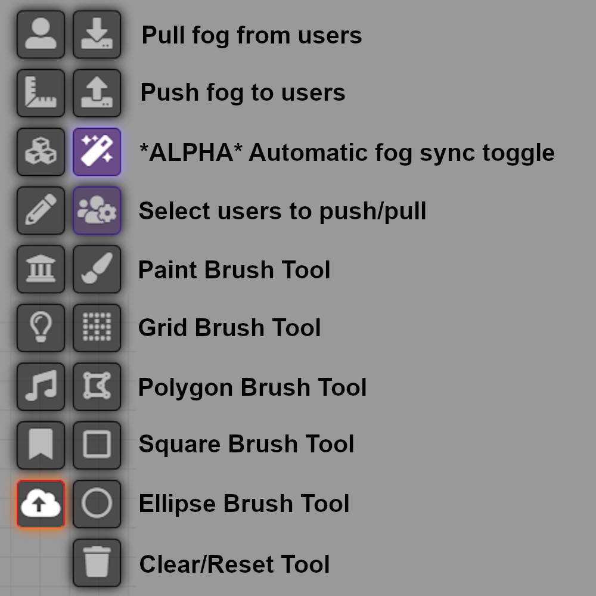

# Fog Manager
A module for [FoundryVTT](https://foundryvtt.com) that lets you edit fog of war manually, and push/pull it to players.
 
* Did a player miss a week and now their fog is now out of date compared to everyone else?
* Did the DM miss a wall and accidentally expose parts of the map?
* Did the players find a map fragment, and you wish to update the fog to match?
Fog Manager will let you update the fog to handle these use cases.

A note for anyone here looking for a Simple Fog replacement:  Fog Manager is slightly different from Simple Fog because it does its editing directly to the normal fog layer, vs the secondary layer that Simple Fog does. If you need to ability to restrict vision on top of the normal Fog behavior, you may need to look elsewhere. If however, you just want to edit the existing fog to either hide some previously revealed sections, or reveal new ones, you are in the right spot. 

## Features
- Pull in the fog from all (or some) users, and merge them together
- Broadcast the changes back to all (or some) users
- Edit the fog to reveal new locations (players received a map?), or hide them (brain wipe?)
- Implements a history system, so you can easily undo your actions
- Various drawing tools for drawing and erasing fog of war manually
  - Brush tool
    - Hotkeys for quickly changing brush size [ ]
  - Rectangle & Ellipse tool
    - Hold shift to force equal width & height while drawing
  - Polygon Shape tool
    - Click the orange handle to finish your drawing, or right click to cancel
  - Grid tool
    - Reveals any grid square you drag across, works for both Hex and Square grids

# Usage 
1. Open Fog manager by clicking on the cloud on the toolbar.
2. (Optional) Click on the user config to configure which players to pull from. (Default is all)
   1. You can pull and push from different sets of users.
3. Pull the fog from all selected players by clicking the download icon 
4. Edit the fog using the various brushes, and the Hide/Reveal slider.
5. Broadcast the changes to all selected players with the Upload Icon 

## Demo

## Compatability
* Image fog - Seems to work normally. The GM can even see the image layer when editing fog
* Less fog - Seems to work normally.  Unexplored levels values set there apply when editing fog.
* Simple fog - Seems to work normally. Now with different icons to tell the tools apart. 

## Future Features
* Quickly toggle individual players to compare their fog.
* Automatic syncing between players
* Save snippets for easy sharing (players find a map?)

## Known issues
* Remote user updates between "Merge" and "Broadcast", might be kept, depending on if it trips the foundry save function (10 updates).  Pausing while editing is recommended.

# Questions
Feel free to contact me on Discord \@ChrisF#4895, by filing an issue on GitLab, or using the [Bug Reporter Module](https://foundryvtt.com/packages/bug-reporter/).

# Special Thanks
This is a derivative of https://github.com/VanceCole/simplefog under the MIT License.
